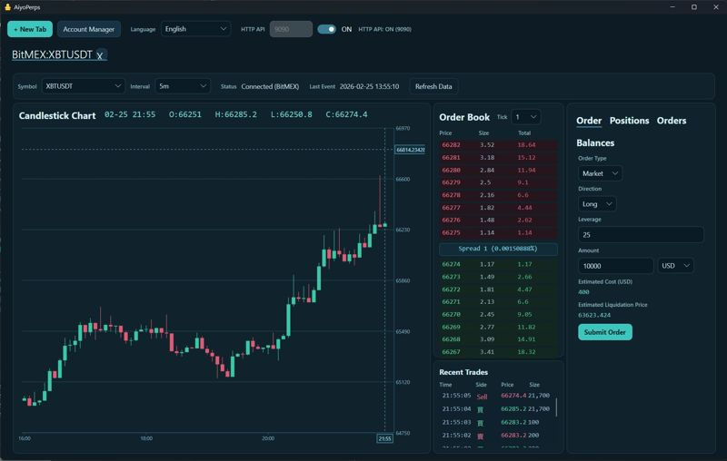
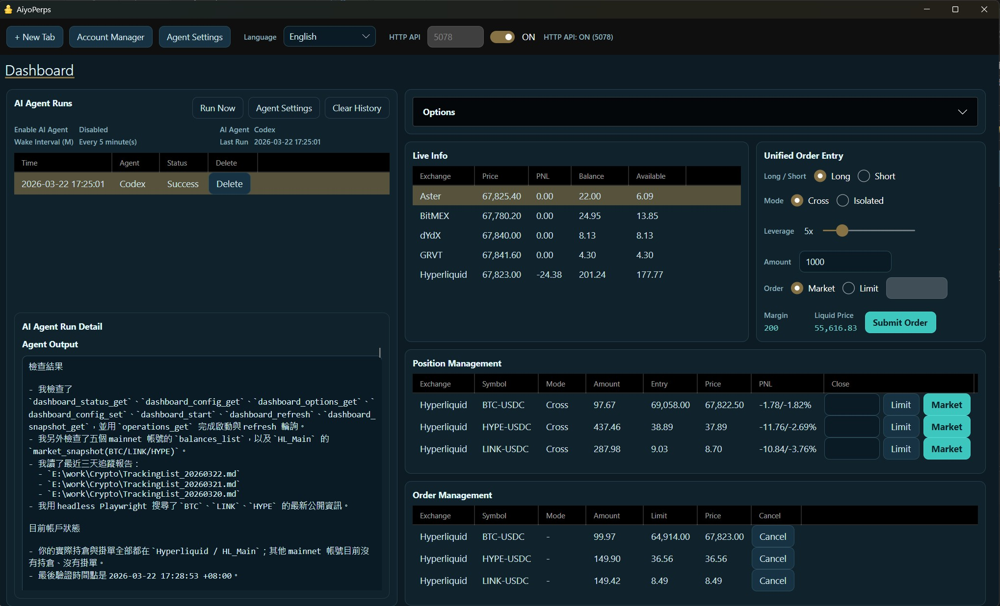
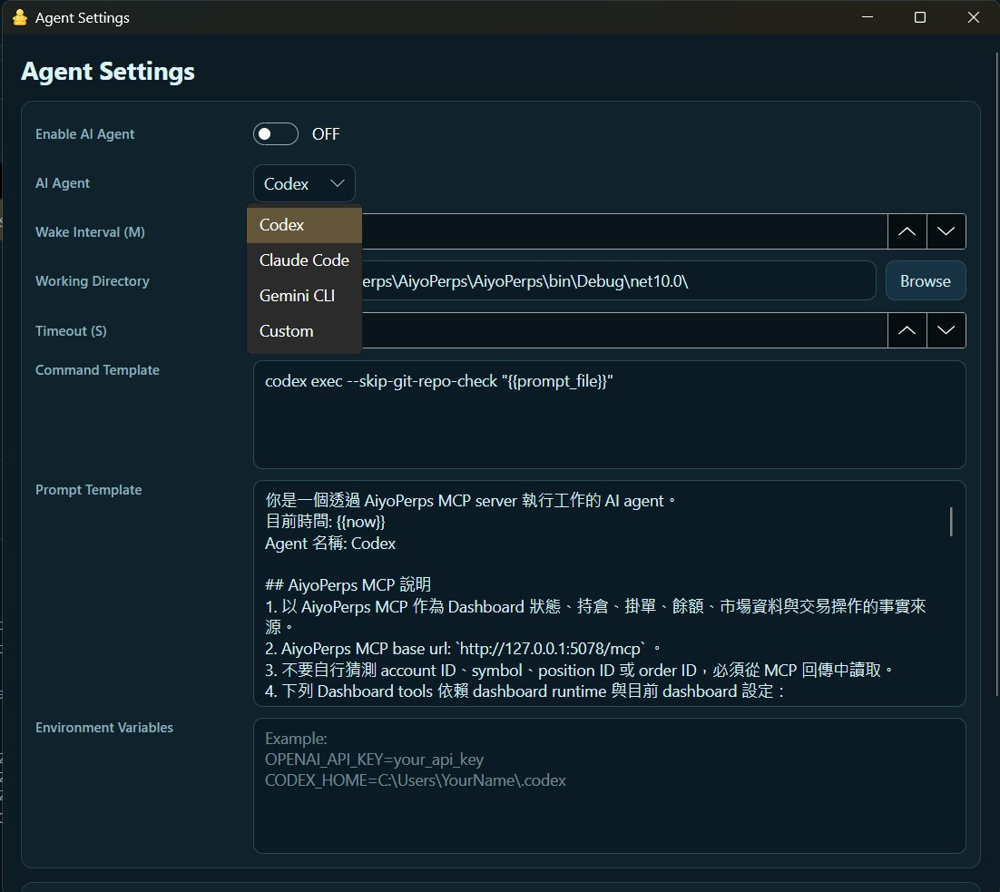
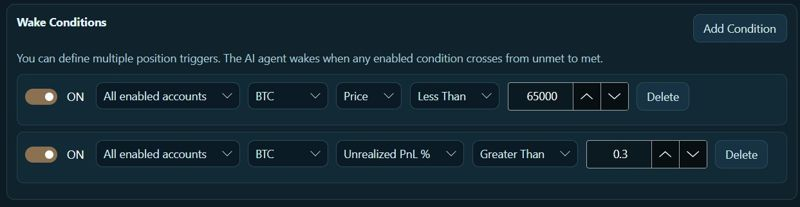
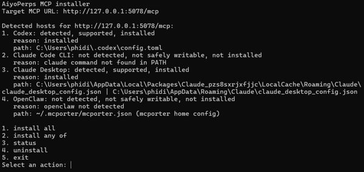

# AiyoPerps

### [**繁體中文**](./Readme_zh.md) | [**Official Website**](https://perps.aiyo.app)

AiyoPerps is a perpetual futures desktop terminal that supports both CEX (centralized) and DEX (decentralized) trading. It provides a full desktop UI, an MCP server for AI agents, and a local REST API.<br>
All your data is stored locally in SQLite, in the db folder under the program execution path. Your data will not leave the local machine, and you do not need to give any API key to the AI ​​Agent.<br>
With AiyoPerps, you can trade crypto perpetual futures **manually**, **with AI collaboration**, or **fully driven by AI**.



## Support Us
If you think this project is cool, feel free to [**buy us a coffee**](https://utunote.com/AiyoPerps/donate)!<br>
**When you sponsor us, you’ll also get a chance to join Taiwan’s receipt lottery.**<br>
That’s because [Chen-Si Studio](https://utunote.com) is a team that pays taxes properly. We issue an official receipt/invoice for every bit of income, and those invoice numbers can be checked for prizes every two months.<br>
Even if you don’t live in Taiwan, if your invoice wins, just let us know. We’ll claim the prize for you and then send you the money (after deducting any necessary handling fees).

## Recent Updates
- Added a **Dashboard** interface, allowing you to manage all your positions and open orders across all exchanges from a single interface.



- Added a feature to **automatically wake up the AI ​​Agent** at fixed intervals, supporting [Codex CLI](https://developers.openai.com/codex/cli), [Claude Code CLI](https://code.claude.com/docs/en/cli-reference), and [Gemini CLI](https://geminicli.com/).



- A new conditional wake-up AI Agent has been added, which allows you to set the AI ​​Agent to be activated only when the market price or profit reaches a set condition.



## 0. Supported Exchanges
- CEX: [BitMEX](https://www.bitmex.com/)
- DEX: [Hyperliquid](https://app.hyperliquid.xyz/), [Aster](https://www.asterdex.com/), [Grvt](https://grvt.io/), [dYdX](https://dydx.trade/)

## 1. Requirements
- Windows, Linux, or macOS (via Docker).
- .NET 10 Runtime (included in release builds).
- A perpetual futures exchange account. Current supported venues are `Hyperliquid`, `BitMEX`, `dYdX`, `Grvt`, and `Aster`.

## 2. Run the Desktop App
### Use a release build
1. Download the latest package from [GitHub Releases](https://github.com/phidiassj/AiyoPerps/releases/latest).
2. Run:
   - Windows: `AiyoPerps.exe`
   - Linux AppImage:
     ```bash
     chmod +x AiyoPerps-x86_64.AppImage
     ./AiyoPerps-x86_64.AppImage
     ```

### Verify a Linux AppImage download

```bash
sha256sum -c AiyoPerps-x86_64.AppImage.sha256
```

### Build a Linux AppImage
1. Publish the Linux self-contained build:
   `dotnet publish ./AiyoPerps/AiyoPerps.csproj -c Release -r linux-x64 --self-contained true -p:PublishSingleFile=true -p:IncludeNativeLibrariesForSelfExtract=true -o "./publish/linux-x64"`
2. On Linux, run:
   `./scripts/appimage/build-appimage.sh`
3. Generate the checksum file:
   `sha256sum ./artifacts/appimage/AiyoPerps-x86_64.AppImage > ./artifacts/appimage/AiyoPerps-x86_64.AppImage.sha256`
4. The AppImage and checksum file will be created under `./artifacts/appimage/`

### Build and run from source
1. Clone this repo or download the full source code.<br>
   `git clone https://github.com/phidiassj/AiyoPerps.git`
2. Build it with [Visual Studio 2026](https://visualstudio.microsoft.com/insiders).

## 3. Enable the Local MCP Server and API
1. Start the desktop app.
2. In the top toolbar, set the `HTTP API` port (default `5078`).
3. Turn the API switch `ON`.
4. Open:
   - OpenAPI UI: `http://127.0.0.1:5078/scalar`
   - MCP endpoint: `http://127.0.0.1:5078/mcp`

## 4. Headless Mode
Use this when you only need REST or MCP.

### Local headless
Start the app with `-- headless --port 5078`.<br>
```bash
Windows:
AiyoPerps.exe -- headless --port 5078
```
```bash
Linux:
./AiyoPerps -- headless --port 5078
```

### Docker
macOS is currently supported through Docker only.<br>
```bash
docker run --rm --name aiyoperps -p 5078:5078 phidiassj/aiyoperps:latest
```
The container starts automatically in headless mode and enables the HTTP API automatically.

## 5. Connect an AI Agent
### Recommended: use the installer to auto-register with supported AI agents
```bash
npx -y @phidiassj/aiyoperps-mcp-installer
```
This registers AiyoPerps with supported AI agents such as Codex, Claude Desktop, Claude Code CLI, and OpenClaw.<br>
<br>


### Manual stdio bridge
```bash
npx -y @phidiassj/aiyoperps-mcp-bridge --quiet --url http://127.0.0.1:5078/mcp
```
If the installer does not support your AI agent, try this manual method.

## 6. Quick UI Workflow
1. Open `Account Manager` and add an account.
2. Create or select a tab.
3. Choose the account, then click `Enable`.
4. Set `Symbol` and `Interval`.
5. Use the right-side tabs for `Order`, `Positions`, `Orders`, and `Balances`.

## 7. More Details
- Full API and MCP guide: [API.md](./API.md)
- 繁體中文 API guide: [API_zh.md](./API_zh.md)
