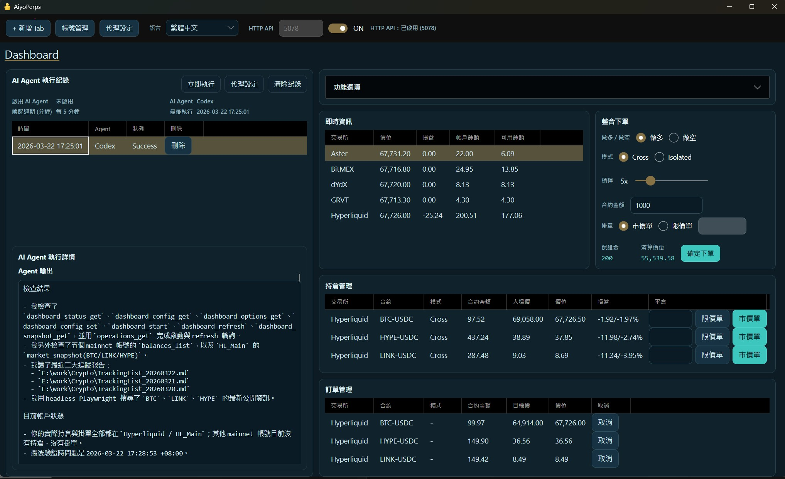
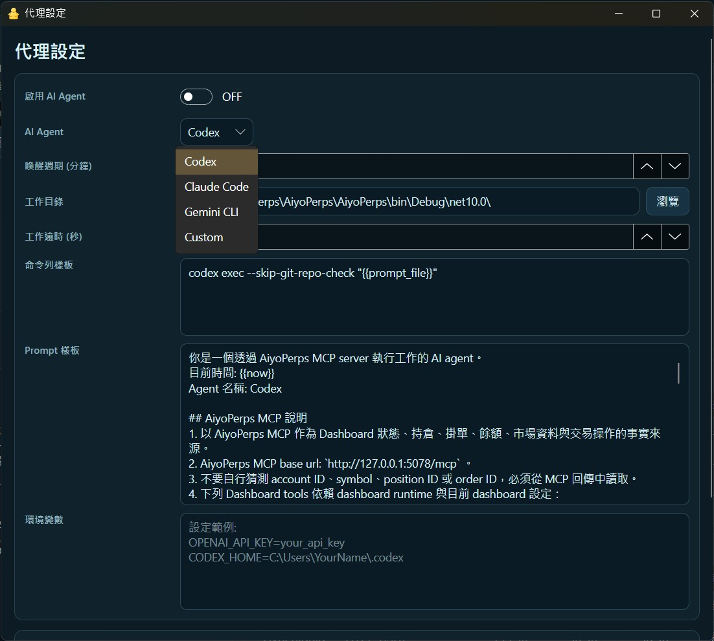
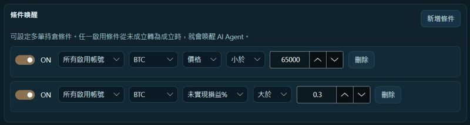

# AiyoPerps

### [**English**](./README.md) | [**官方網站**](https://perps.aiyo.app)

AiyoPerps 是一套同時支援 CEX (中心化) 與 DEX (去中心化) 的永續合約桌面交易終端，提供完整桌面 UI、給 AI Agent 使用的 MCP Server，以及本機 REST API。<br>
你所有的資料都儲存在本地 SQLite，程式執行路徑下的 db 資料夾，你的資料不會離開本機，你也不需要將 API key 交給 AI Agent。<br>
你可以基於 AiyoPerps 實現 **手動**、**與 AI 協作**，或 **完全由 AI 操作** 加密貨幣永續合約交易。


## 支持我們
如果你覺得這個專案不錯，[**請我們喝杯咖啡**](https://utunote.com/AiyoPerps/donate)吧!<br>
**贊助我們的同時，你也會獲得參加台灣發票樂透的機會!**<br>
因為[宸泗工作室](https://utunote.com)是誠實納稅的團隊，我們的每一筆收入都會開立發票，發票號碼每兩個月可以兌獎一次。<br>
即使你不是台灣的居民，如果你中獎了，請通知我們。我們會幫你兌獎之後(扣除必要的手續費)匯款給你。

## 近期更新
- 新增 **Dashboard** 介面，現在在同一個介面就可以管理所有交易所的所有持倉及掛單。



- 新增**固定時間主動喚醒 AI Agent** 功能，支援 [Codex CLI](https://developers.openai.com/codex/cli)、[Claude Code CLI](https://code.claude.com/docs/zh-TW/cli-reference)、[Gemini CLI](https://geminicli.com/)。



- 新增**條件式喚醒** AI Agent，可以設定當合約價位或獲利到達設定條件時，才喚醒 AI Agent。



## 0. 支援的交易平台
- CEX: [BitMEX](https://www.bitmex.com/)
- DEX: [Hyperliquid](https://app.hyperliquid.xyz/)、[Aster](https://www.asterdex.com/)、[Grvt](https://grvt.io/)、[dYdX](https://dydx.trade/)

## 1. 環境需求
- Windows、Linux、MacOS (透過 docker)。
- .NET 10 Runtime (發佈版本已內建)。
- 永續合約交易平台帳號，目前支援 `Hyperliquid`, `BitMEX`, `dYdX`, `Grvt`, and `Aster`。

## 2. 執行桌面版
### 使用發佈版本
1. 到 [GitHub Releases](https://github.com/phidiassj/AiyoPerps/releases/latest) 下載最新版本。
2. 執行：
   - Windows：`AiyoPerps.exe`
   - Linux AppImage：
     ```bash
     chmod +x AiyoPerps-x86_64.AppImage
     ./AiyoPerps-x86_64.AppImage
     ```

### 驗證 Linux AppImage 下載檔

```bash
sha256sum -c AiyoPerps-x86_64.AppImage.sha256
```

### 建立 Linux AppImage
1. 發佈 Linux self-contained 版本：
   `dotnet publish ./AiyoPerps/AiyoPerps.csproj -c Release -r linux-x64 --self-contained true -p:PublishSingleFile=true -p:IncludeNativeLibrariesForSelfExtract=true -o "./publish/linux-x64"`
2. 在 Linux 上執行：
   `./scripts/appimage/build-appimage.sh`
3. 產生 checksum 檔：
   `sha256sum ./artifacts/appimage/AiyoPerps-x86_64.AppImage > ./artifacts/appimage/AiyoPerps-x86_64.AppImage.sha256`
4. AppImage 與 checksum 檔都會輸出到 `./artifacts/appimage/`

### 從原始碼編譯執行
1. Clone 此 repo 或下載完整原始碼。<br>
   `git clone https://github.com/phidiassj/AiyoPerps.git`
2. 使用 [Visual Studio 2026](https://visualstudio.microsoft.com/insiders) 編譯。

## 3. 啟用本機 MCP Server 及 API
1. 啟動桌面程式。
2. 在上方工具列設定 `HTTP API` 埠號（預設 `5078`）。
3. 將 API 開關切到 `ON`。
4. 可直接開啟：
   - OpenAPI 介面：`http://127.0.0.1:5078/scalar`
   - MCP 端點：`http://127.0.0.1:5078/mcp`

## 4. 無介面模式
只需要 REST 或 MCP 時可使用。

### 本機 headless
使用 -- headless --port 5078 啟動軟體<br>
```bash
Windows:
AiyoPerps.exe -- headless --port 5078
```
```bash
Linux:
./AiyoPerps -- headless --port 5078
```

### Docker
MacOS 目前僅能透過 Docker 使用。<br>
```bash
docker run --rm --name aiyoperps -p 5078:5078 phidiassj/aiyoperps:latest
```
容器會自動以 headless 模式啟動，並自動開啟 HTTP API。

## 5. 連接 AI Agent
### 建議：使用 installer 自動安裝到支援的 AI Agent
```bash
npx -y @phidiassj/aiyoperps-mcp-installer
```
這會把 AiyoPerps 註冊到 Codex、Claude Desktop、Claude Code CLI、OpenClaw 等支援的 AI Agent。<br>
<br>


### 手動使用 stdio bridge
```bash
npx -y @phidiassj/aiyoperps-mcp-bridge --quiet --url http://127.0.0.1:5078/mcp
```
如果自動安裝 Installer 不支援你的 AI Agent，你可以嘗試使用這個方式。

## 6. UI 快速流程
1. 開啟 `Account Manager` 新增帳號。
2. 建立或選取一個分頁。
3. 選擇帳號後按 `Enable`。
4. 設定 `Symbol` 與 `Interval`。
5. 右側可切換 `下單`、`持倉`、`訂單`、`餘額` 分頁。

## 7. 進一步說明
- 完整 API 與 MCP 文件：[API_zh.md](./API_zh.md)
- English API guide: [API.md](./API.md)
